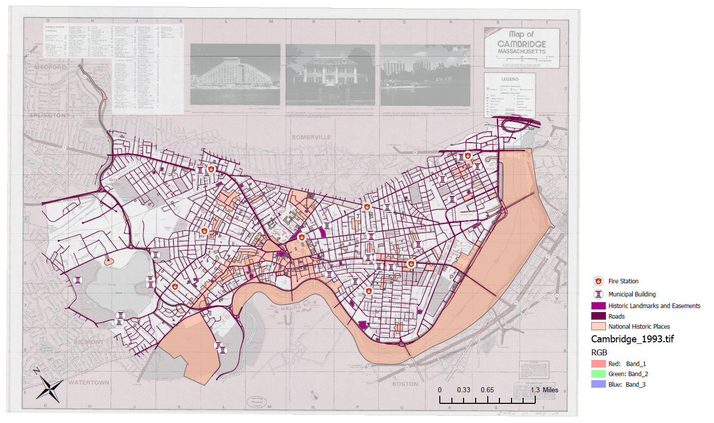
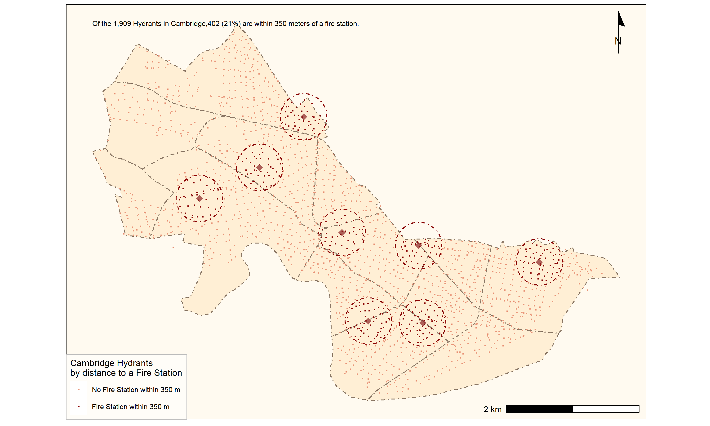
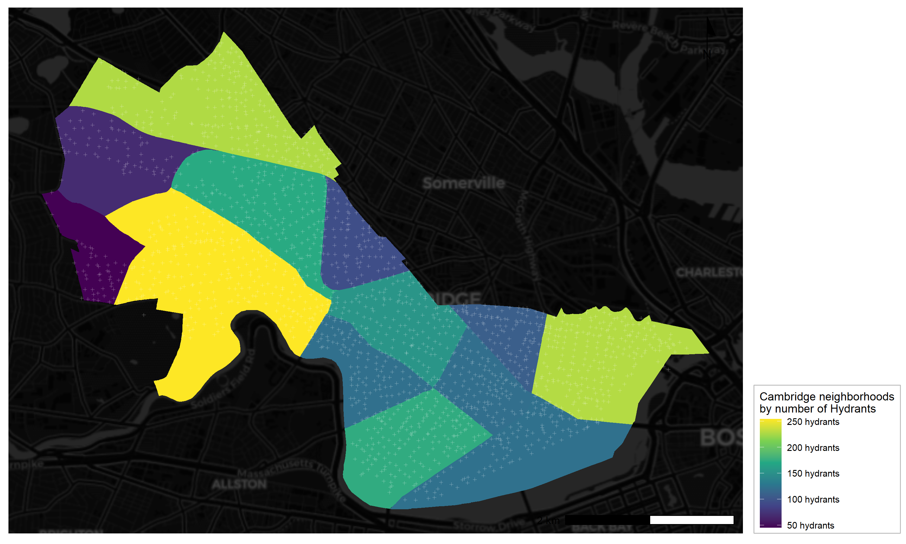
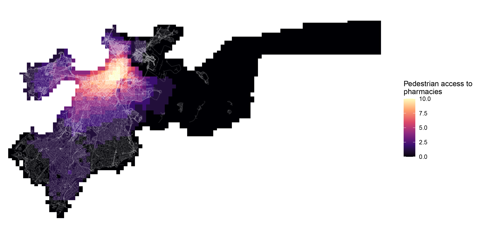
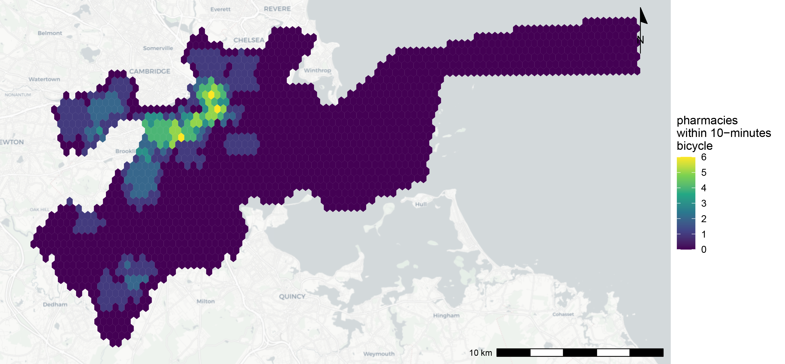
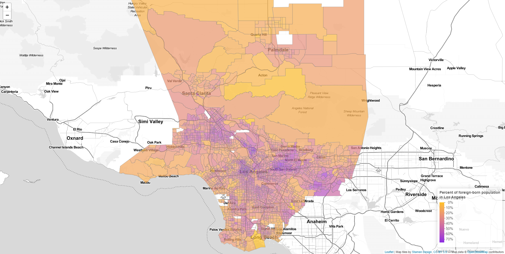

```{r setup, include=FALSE}
knitr::opts_chunk$set(echo = TRUE)
```

# Introduction

The maps displayed in this website are revised from the maps producing in the VIS 2128 Spatial Analysis Class in Fall 2021 (Instructed by Prof. Carole Turley Voulgaris). In these maps, I use the following skills learning from the class: 

1. Displaying multiple vector layers on the same map
2. Calculating and displaying relationships among point and polygon layers based on distance
3. Aggregating point data to a layer of polygons
4. Calculating and displaying accessibility, based on travel time
5. Converting between raster layers and vector layers
6. Displaying raster data on a map
7. Georeferencing a raster image
8. Displaying data on an interactive map

By clicking on the map, you could access the full-size image of the maps (or the interactive map).

# Maps of Cambridge

Three maps of Cambridge are included. The first one demonstrates the changes of public facilities in the city by overlapping spatial data of fire stations and municipal buildings to a 1993 map collected from the Harvard Map Collection. The second and third one show the relationship between hydrants to fire stations, and hydrants within each neighborhood. 

## Public Facilities' Change

This map demonstrates the following skills:

* Displaying raster data on a map
* Georeferencing a raster image

[](https://estheryyao.github.io/Final-Portfolio/fullsize/CamOld.pdf){target="_blank"}


## Hydrants to Fire Stations

This map demonstrates the following skills:

* Calculating and displaying relationships among point and polygon layers based on distance
* Displaying multiple vector layers on the same map

[](https://estheryyao.github.io/Final-Portfolio/fullsize/HyF.pdf){target="_blank"}


## Number of Hydrants

This map demonstrates the following skills:

* Aggregating point data to a layer of polygons

[](https://estheryyao.github.io/Final-Portfolio/fullsize/Hydrants in Nei.pdf){target="_blank"}


# Map of Boston

Two maps of Boston are included. Both of them aim at calculating the accessibility of pharmacies through different transportation mode. 

## Pedestrian accessibility

This map demonstrates the following skills:

* Calculating and displaying accessibility, based on travel time
* Converting between raster layers and vector layers
* Displaying raster data on a map

[](https://estheryyao.github.io/Final-Portfolio/fullsize/pedestrian accessibility2.pdf){target="_blank"}


## Accessibility through Bicycle

This map demonstrates the following skills:

* Calculating and displaying accessibility, based on travel time

[](https://estheryyao.github.io/Final-Portfolio/fullsize/ByP.pdf){target="_blank"}


# Map of Los Angeles

In the end, an interactive map of Los Angeles County is included. By clicking on each census tract, one can see the total population of the tract and the percentage of foreign-born population. 

## Interactive Foreign-born population

This interactive map demonstrates the following skills: 

* Displaying data on an interactive map

[](https://estheryyao.github.io/Final-Portfolio/fullsize/Foreignborn in LA.html){target="_blank"}

